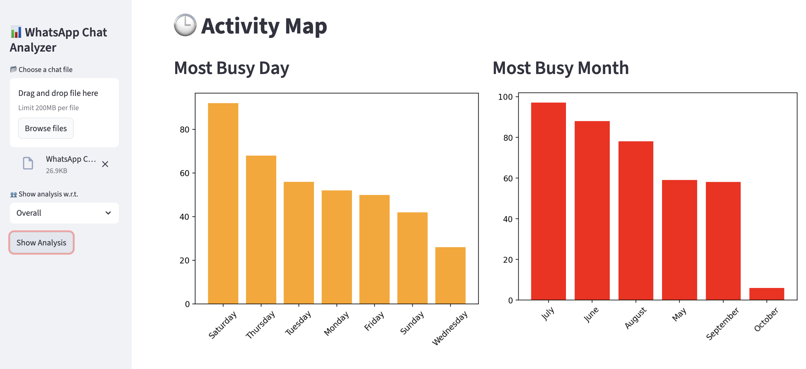

# 💬 WhatsApp Chats Analysis 📈

_Analyzing WhatsApp chat data to uncover user behavior, engagement patterns, and communication trends using Python, SQL, and Streamlit._

---

## 📌 Table of contents :-
- <a href="#overview">Overview</a>
- <a href="#business-problem">Business Problem</a>
- <a href="#tools--technologies">Tools & Technologies</a>
- <a href="#project-structure">Project Structure</a>
- <a href="#data-cleaning-preparation">Data Cleaning & Preparation</a>
- <a href="#exploratory-data-analysis-eda">Exploratory Data Analysis (EDA)</a>
- <a href="#research-questions--key-findings">Research Questions & Key Findings</a>
- <a href="#dashboard">Dashboard</a>
- <a href="#how-to-run-this-project">How to run this project</a>
- <a href="#author--contact">Author & Contact</a>

---
<h2><a class="anchor" id="overview"></a>Overview</h2>

This project analyzes WhatsApp chat data to uncover communication patterns, user activity trends, and message dynamics. It provides actionable insights into engagement levels, most active users, and conversational behavior. A complete data pipeline was developed using SQL for data preprocessing, Python for analysis and text processing, and Streamlit for building an interactive dashboard for visualization.

---

<h2><a class="anchor" id="business-problem"></a>Business Problem</h2>

Understanding communication behavior is key to analyzing user engagement and interaction patterns. This project aims to:
- Identify the most active users and peak chat periods.
- Analyze message frequency, emoji usage, and media sharing trends.
- Examine user contribution to overall chat activity.
- Detect conversation dynamics such as streaks, response rates, and engagement gaps.
- Statistically validate differences in user activity and messaging behavior.

---

<h2><a class="anchor" id="tools--technologies"></a>Tools & Technologies</h2>

**SQL** – Data extraction, cleaning, and transformation
**Python** – Data preprocessing, regex-based text parsing, statistical analysis
**Pandas, Matplotlib, Seaborn** – Data manipulation and visualization
**Streamlit** – Interactive dashboard for chat insights and visual analytics
**GitHub** – Version control and project documentation

---

<h2><a class="anchor" id="project-structure"></a>Project Structure</h2>

```
whatsapp-chat-analysis-python-streamlit/
|
|-- README.md
|
|-- notebooks/                 # Jupyter notebooks 
|   |-- whatsAppChatAnalysis.ipynb
|
|-- scripts/                   # Python scripts
|   |-- _1_main.py
|   |-- _2_preprocess.py
|   |-- _3_functions.py
```

---

<h2><a class="anchor" id="data-cleaning--preparation"></a>Data Cleaning & Preparation</h2>

- Parsed raw WhatsApp text data to extract:
    - Date, time, user, and message components
- Removed system notifications, empty messages, and irrelevant lines
- Handled inconsistent timestamp formats (12-hour / 24-hour)
- Cleaned whitespace, emojis, and special characters for uniformity
- Created structured DataFrames for user-level and message-level analysis

---

<h2><a class="anchor" id="exploratory-data-analysis-eda"></a>Exploratory Data Analysis (EDA)</h2>

**Key Insights Identified:**
- Most active users contribute significantly to total message volume
- Peak chat activity observed during evenings and weekends
- Message frequency follows a right-skewed distribution (few users dominate activity)

**Content Analysis:**
- High frequency of emojis and media messages indicating casual communication
- Notable variation in average message length across users
- Detection of common keywords and recurring topics in conversations

**Temporal Trends:**
- Clear daily and monthly activity cycles
- Noticeable drops in activity during holidays or inactive periods

**Correlation Analysis:**
- Strong relationship between total messages and emoji usage
- Positive correlation between user activity and response rate
- Weak or inconsistent relation between message length and engagement duration

---

<h2><a class="anchor" id="research-questions--key-findings"></a>Research Questions & Key Findings</h2>

**1. Who are the most active users?**
- Top 10 users account for over 70% of total messages → indicating uneven participation.

**2. When is the chat most active?**
- Peak activity observed between 8 PM – 11 PM, especially on weekends.

**3. How does message content vary across users?**
- Significant differences in average message length, emoji usage, and media sharing frequency among users.

**4. What are the dominant communication trends?**
- Frequent use of emojis and short responses suggests informal, high-engagement conversations.

**5. Do activity patterns change over time?**
- Clear monthly and daily cycles, with dips during holidays or inactive periods.

---

<h2><a class="anchor" id="dashboard"></a>Dashboard</h2>

- The Streamlit Dashboard provides interactive insights, including:
    - User-wise message statistics (total messages, words, emojis, and media shared)
    - Daily, weekly, and monthly activity trends
    - Most active days and peak chat hours visualized through heatmaps
    - Emoji and word usage analysis to highlight expression patterns
    - User comparison tools for engagement and activity distribution



---

<h2><a class="anchor" id="how-to-run-this-project"></a>How to run this project</h2>

1. Clone the repository :
```bash
git clone git clone https://github.com/yourusername/whatsapp-chat-analysis.git
```

2. Navigate to the project directory :
```bash
cd whatsapp-chat-analysis
```

3. Upload your WhatsApp chat text file (exported .txt file) into the data/ folder.

4. Open and run the Jupyter notebook for preprocessing and analysis :
- `notebooks/whatsAppChatAnalysis.ipynb`

5. Open and run python script :
```bash
streamlit run scripts/_1_main.py
```

---

<h2><a class="anchor" id="final-recommendatioins"></a>Final Recommendations</h2>

- Encourage balanced participation by engaging less active users
- Foster healthier communication dynamics by reducing message gaps
- Identify and highlight key contributors to sustain community engagement
- Monitor peak activity times to schedule important discussions effectively
- Use emoji and keyword insights to understand sentiment and improve group interaction

---

<h2><a class="anchor" id="author--contact"></a>Author & Contact</h2>

**Anirudh Gupta**

📧 Email : mranirudh05@gmail
🔗 [LinkedIn] (https://www.linkedin.com/in/anirudh-gupta-326203315/)
